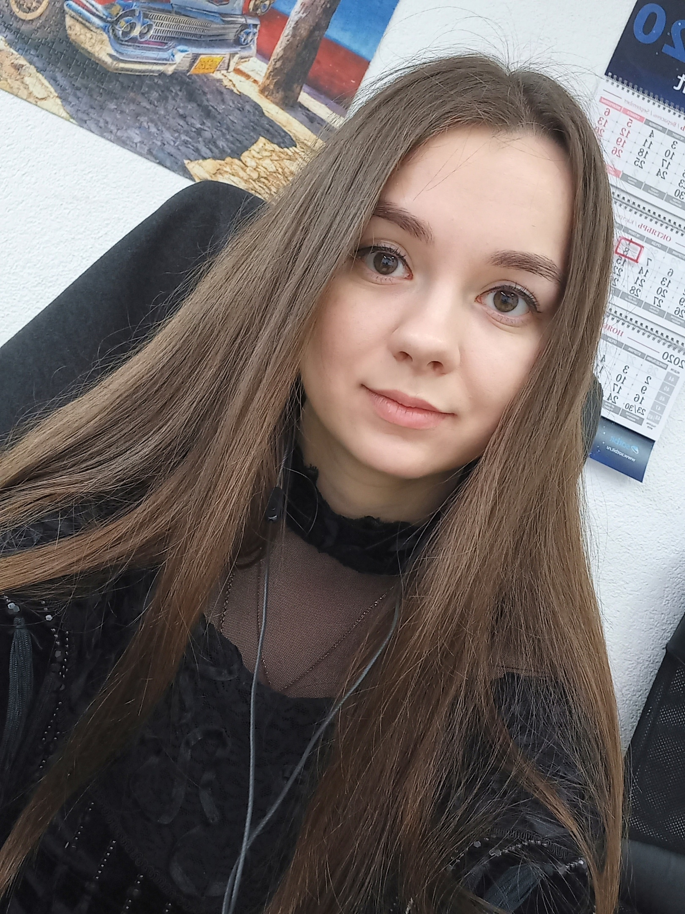

# About me

1. Alina Razumava
2. email - alinka01010@mail.ru ,discord - Alinka(@Alinka-v)
3. I want to try myself in the front-end, this direction has always been interesting.
I love learning and helping others.
Worked in the technical support of an IT company.
4. PHP, C#,Bitrix
5. 
```
public class CustomMath {
    public static int multiply(int a, int b) {
        return a*b;
    }
}

```
6. 2.5 years of work as a technical support specialist
7. Higher education, specialty - software engineer
8. A2-B1
9. https://github.com/Alinka-v/rsschool-cv/blob/gh-pages/cv.md

